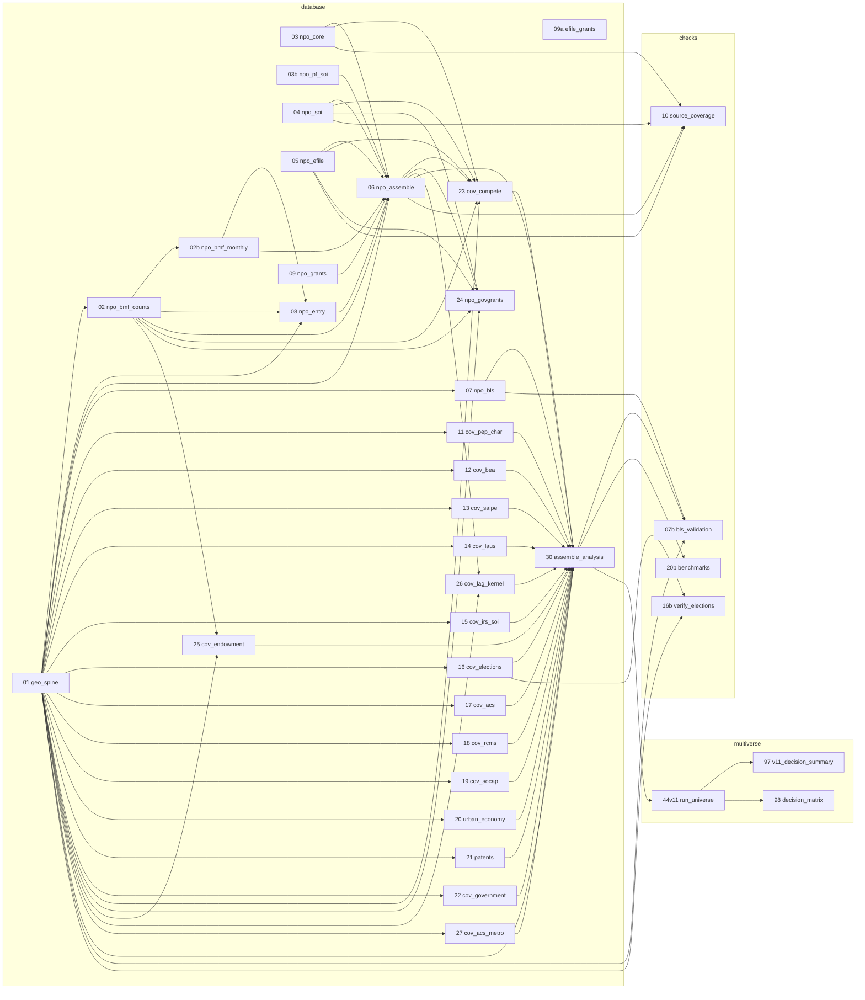

# Pipeline dependency graph

Generated by `Rscript run.R --graph` from `pipeline.csv`. An edge means the later step
reads a file the earlier step writes (raw sources are not shown).

```mermaid
flowchart LR
  subgraph database
    s01["01 geo_spine"]
    s02["02 npo_bmf_counts"]
    s03["03 npo_core"]
    s03b["03b npo_pf_soi"]
    s04["04 npo_soi"]
    s05["05 npo_efile"]
    s02b["02b npo_bmf_monthly"]
    s08["08 npo_entry"]
    s09a["09a efile_grants"]
    s09["09 npo_grants"]
    s06["06 npo_assemble"]
    s07["07 npo_bls"]
    s11["11 cov_pep_char"]
    s12["12 cov_bea"]
    s13["13 cov_saipe"]
    s14["14 cov_laus"]
    s15["15 cov_irs_soi"]
    s16["16 cov_elections"]
    s17["17 cov_acs"]
    s18["18 cov_rcms"]
    s19["19 cov_socap"]
    s20["20 urban_economy"]
    s21["21 patents"]
    s22["22 cov_government"]
    s23["23 cov_compete"]
    s24["24 npo_govgrants"]
    s25["25 cov_endowment"]
    s26["26 cov_lag_kernel"]
    s27["27 cov_acs_metro"]
    s30["30 assemble_analysis"]
  end
  subgraph checks
    s10["10 source_coverage"]
    s07b["07b bls_validation"]
    s16b["16b verify_elections"]
    s20b["20b benchmarks"]
  end
  subgraph multiverse
    s44v11["44v11 run_universe"]
    s97["97 v11_decision_summary"]
    s98["98 decision_matrix"]
  end
  s01 --> s02
  s02 --> s02b
  s01 --> s08
  s02 --> s08
  s02b --> s08
  s03 --> s06
  s04 --> s06
  s03b --> s06
  s05 --> s06
  s09 --> s06
  s02 --> s06
  s02b --> s06
  s08 --> s06
  s01 --> s06
  s01 --> s07
  s01 --> s11
  s01 --> s12
  s01 --> s13
  s01 --> s14
  s01 --> s15
  s01 --> s16
  s01 --> s17
  s01 --> s18
  s01 --> s19
  s01 --> s20
  s01 --> s21
  s01 --> s22
  s03 --> s23
  s04 --> s23
  s05 --> s23
  s02 --> s23
  s06 --> s23
  s01 --> s23
  s04 --> s24
  s05 --> s24
  s02 --> s24
  s06 --> s24
  s01 --> s24
  s02 --> s25
  s01 --> s25
  s01 --> s26
  s06 --> s26
  s01 --> s27
  s06 --> s30
  s01 --> s30
  s11 --> s30
  s12 --> s30
  s13 --> s30
  s14 --> s30
  s15 --> s30
  s16 --> s30
  s17 --> s30
  s18 --> s30
  s19 --> s30
  s20 --> s30
  s21 --> s30
  s22 --> s30
  s07 --> s30
  s23 --> s30
  s25 --> s30
  s26 --> s30
  s27 --> s30
  s06 --> s10
  s03 --> s10
  s04 --> s10
  s05 --> s10
  s07 --> s07b
  s30 --> s07b
  s01 --> s07b
  s16 --> s16b
  s01 --> s16b
  s30 --> s20b
  s30 --> s44v11
  s44v11 --> s97
  s44v11 --> s98
```
